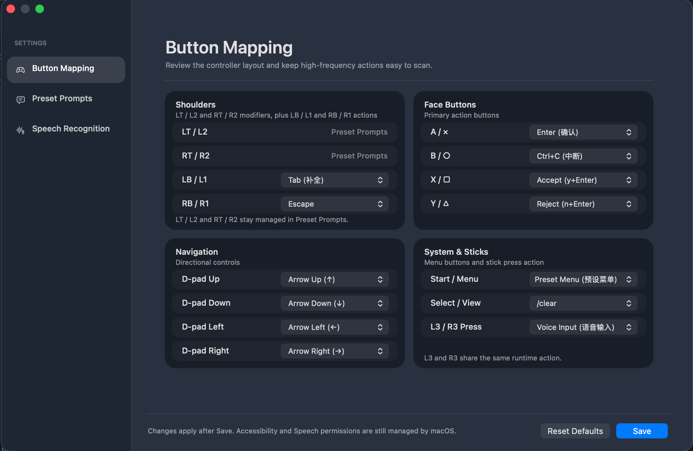
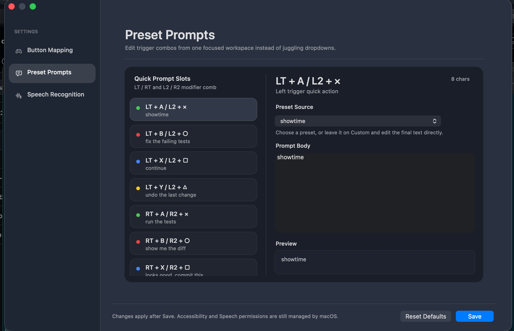
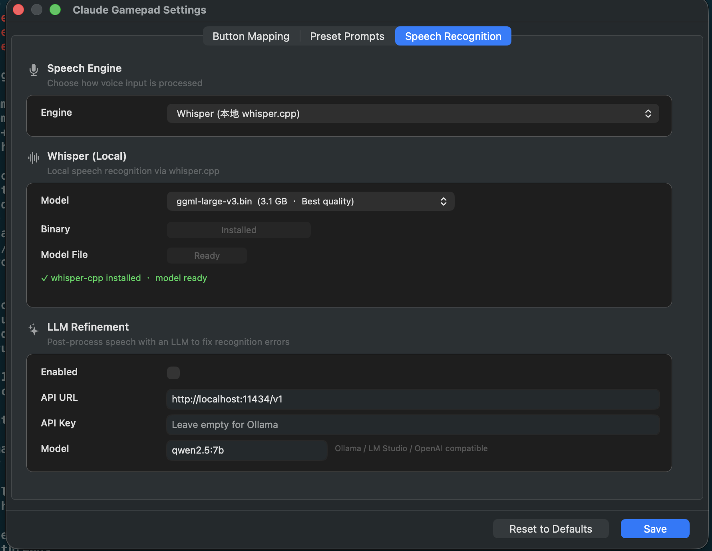

# Claude Gamepad Controller

[](https://www.apple.com/macos/)
[](https://swift.org/)
[](LICENSE)
[](https://github.com/xargin/ClaudeGamepad)

macOS 菜单栏应用，用游戏手柄控制 [Claude Code](https://claude.ai/claude-code)。躺在沙发上 vibe coding。

支持 Xbox、PS5 DualSense 及所有 MFi 兼容手柄。内置语音输入（Apple 系统语音识别 / 本地 [whisper.cpp](https://github.com/ggerganov/whisper.cpp)），可选 LLM 语音纠错。

## 为什么用 Claude Gamepad？

想躺在沙发上写代码吗？Claude Gamepad 让游戏手柄成为 AI 编程的利器。告别键盘前的僵硬坐姿，用手柄操控 Claude Code，站着用、躺着用、随便你怎么舒服怎么用。

**适合场景：**
- 有 RSI 或行动不便的开发者
- 站立办公人群
- 客厅编程
- 语音优先的双手自由工作流

## 目录

- [快速开始](#快速开始)
- [功能特点](#功能特点)
- [截图](#截图)
- [默认按键映射](#默认按键映射)
- [安装](#安装)
- [使用说明](#使用说明)
- [配置](#配置)
- [语音输入](#语音输入)
- [Vibe Island / 覆盖层导航](#vibe-island--覆盖层导航)
- [排障](#排障)
- [贡献指南](#贡献指南)
- [架构](#架构)
- [许可证](#许可证)

## 快速开始

5 分钟内上手：

```bash
# 1. 克隆并构建
git clone https://github.com/xargin/ClaudeGamepad.git
cd ClaudeGamepad
swift build -c release

# 2. 运行应用
swift run

# 3. 按提示授予权限
# - 辅助功能（键盘模拟）
# - 语音识别（语音输入）
```

连接手柄，聚焦 Claude Code 终端，开始编程！

## 功能特点

- **菜单栏常驻** - 后台运行，无 Dock 图标
- **即插即用** - 通过 `GCController` 自动识别 Xbox / PS5 / MFi 手柄
- **Xbox / PS5 样式切换** - 整个 UI 的按键文案和颜色可切换
- **全按键自定义** - 每个按键可通过 GUI 设置面板配置
- **语音输入** - 按摇杆说话，转写结果粘贴到终端
  - 系统语音识别（零配置）
  - 本地 whisper.cpp（更高精度，离线可用）
  - 可选 LLM 纠错（Ollama / OpenAI 兼容接口）
- **快捷指令** - LT/RT + 功能键发送预设 prompt
- **命令连招** - 按住 LT+RT 进入命令模式，支持 Helldivers / 格斗游戏两种输入风格
- **预设菜单** - Start 键打开可用方向键导航的 prompt 列表
- **覆盖层导航** - 可配置的 `Guide Key Combo` 可打开 Vibe Island 一类悬浮窗口，并在短时间内把 D-pad 方向键路由过去
- **连招前缀冲突检测** - 设置界面会提示一个 combo 遮住另一个 combo 的情况
- **浮动 HUD** - 非侵入式悬浮层显示按键反馈和转写结果
- **原生 macOS** - 纯 Swift + AppKit，无 Electron，无 Python

## 截图

### 按键映射

用直观的可视化编辑器配置手柄。所有按键按区域分组——肩键、功能键、导航键和系统键，快速扫描和重新分配高频操作。



### 预设指令

构建你的命令面板。在一个聚焦的工作区中编辑所有触发组合，支持预设和自定义 prompt，保存前实时预览字符数和效果。



### 语音识别

一览语音管线全貌。无需打开多个窗口，即可查看引擎状态、二进制安装状态、模型下载进度和 LLM 纠错开关。



### 菜单栏

应用常驻菜单栏。绿色表示手柄已连接，灰色表示未检测到手柄。


## 默认按键映射

| 按键 | 动作 |
|------|------|
| A / ✕ | Enter（确认） |
| B / ○ | Ctrl+C（中断） |
| X / □ | Accept（y + Enter） |
| Y / △ | Reject（n + Enter） |
| D-pad | 方向键 |
| LB / L1 | Tab（补全） |
| RB / R1 | Escape |
| L3 / R3 按下 | 语音输入 |
| Start / Menu | 预设菜单 |
| Select / View / Create | `/clear` |
| LT + 功能键 | 快捷指令（可配置） |
| RT + 功能键 | 快捷指令（可配置） |
| LT + RT | 命令模式（连招输入） |
| LT + RT + Select | 退出 |

所有映射均可在设置中自定义。

> **注意：** macOS 会拦截手柄的硬件 Guide / Home / PS 键。如果你想用手柄打开 Vibe Island 或其他覆盖层，请把别的可捕获按键映射成 `Combo` 动作。

## 安装

### 前置要求

- macOS 14.0 (Sonoma) 或更高版本
- 游戏手柄（Xbox、PS5 DualSense 或 MFi 兼容）
- Whisper（可选）：`brew install whisper-cpp`

### 从源码构建

```bash
git clone https://github.com/xargin/ClaudeGamepad.git
cd ClaudeGamepad
swift build -c release
# 产物位于 .build/release/ClaudeGamepad
```

### 运行

```bash
swift run
```

或构建后复制到系统路径：

```bash
swift build -c release
cp .build/release/ClaudeGamepad /usr/local/bin/
```

## 首次启动

1. 运行 `swift run` 或构建好的二进制
2. 按提示授予**辅助功能**权限（系统设置 > 隐私与安全性 > 辅助功能）— 键盘模拟所需
3. 如使用语音输入，授予**语音识别**权限
4. 连接手柄 — 菜单栏图标变为激活状态
5. 将焦点切到运行 Claude Code 的终端
6. 开始按按钮！

## 使用说明

### 基础操作

| 操作 | 手柄输入 |
|------|----------|
| 导航代码 | D-pad |
| 接受建议 | X / □ |
| 拒绝建议 | Y / △ |
| 触发补全 | LB / L1 |
| 取消 / 中断 | B / ○ |
| 发送 / 确认 | A / ✕ |

### 语音输入

1. 按 **L3 / R3**（摇杆按下）
2. 浮动 HUD 显示 "Listening..."，带实时波形
3. 说出你的 prompt（自动检测中英文）
4. HUD 显示转写结果，`[A=确认 B=取消]`
5. 按 **A** 粘贴到终端，或 **B** 取消

### 快捷指令

按住扳机键（LT 或 RT）并按功能键执行即时命令：

| 扳机 | 按键 | 命令 |
|------|------|------|
| LT | A | `showtime` |
| LT | B | `fix the failing tests` |
| LT | X | `continue` |
| LT | Y | `undo the last change` |
| RT | A | `run the tests` |
| RT | B | `show me the diff` |
| RT | X | `looks good, commit this` |
| RT | Y | `add types and documentation` |

### 命令连招

同时按住两个扳机键（LT+RT）进入命令模式。输入方向序列触发动作：

**Helldivers 2 风格**（只用 D-pad）：
- ↑ ↓ → ← ↑ → 触发"增援"命令

**格斗游戏风格**（方向键 + 按键）：
- ↓ → A → "波动拳"式动作

## 配置

点击菜单栏图标 > **Settings** 打开设置窗口。设置面板采用深色主题卡片式布局，分为五个标签页。

### General

选择 **controller style**（Xbox 或 PS5）。这会同步修改整个 UI、浮层和设置页中的按键文案与颜色。

### 按键映射

按区域展示所有按键绑定：Shoulders（肩键）、Face Buttons（功能键）、Navigation（方向键）、System & Sticks（系统键和摇杆）。每个按键可从下拉菜单选择动作。LT/RT 作为修饰键，对应的快捷指令在预设指令标签页管理。若某个按键被设为 `Combo`，该行会额外显示用于打开覆盖层的快捷键配置。

### 预设指令

左侧列出所有快捷指令槽位（LT+A、LT+B、RT+A 等），右侧为聚焦编辑区。每个槽位可选择预设 prompt 或自定义文本，实时显示字符数和预览。

**默认快捷指令：**

| 触发 | Prompt |
|------|--------|
| LT + A | showtime |
| LT + B | fix the failing tests |
| LT + X | continue |
| LT + Y | undo the last change |
| RT + A | run the tests |
| RT + B | show me the diff |
| RT + X | looks good, commit this |
| RT + Y | add types and documentation |

### 命令连招

同时按住两个扳机键（LT+RT / L2+R2）进入命令模式。输入方向序列即可触发预设 prompt，支持两种风格：

- **Helldivers 2** — 只用 D-pad 序列，例如 `↑ ↓ → ← ↑`
- **Fighting Game** — 方向键加收尾功能键，例如 `↓ → A`

设置页里带有按钮式输入编辑器，不需要手打 Unicode 箭头；同时会检测并提示 combo 前缀冲突。

### 语音识别

顶部 Voice Pipeline 状态栏一览引擎、二进制安装状态、模型下载情况和 LLM 纠错开关。下方分两个卡片：

- **Whisper Local** — 选择模型（tiny 75MB ~ large-v3 3.1GB）、一键安装二进制、一键下载模型
- **LLM Refinement** — 配置 API URL、API Key、模型名，支持 Ollama、LM Studio 或任何 OpenAI 兼容端点

## 语音输入

1. 按 **L3 / R3**（摇杆按下）
2. 浮动 HUD 显示 "Listening..."，带实时波形
3. 说出你的 prompt（自动检测中英文）
4. HUD 显示转写结果，`[A=确认 B=取消]`
5. 按 **A** 粘贴到终端，或 **B** 取消

## Vibe Island / 覆盖层导航

如果你想用手柄打开并操作 Vibe Island 这类吃键盘方向键的悬浮窗口，可以这样配置：

1. 在 **Settings > Button Mapping** 里，把一个空闲按键映射成 `Combo`。
2. 在该行展开出来的 Guide Key Combo 控件里设置快捷键，默认是 `⌘G`。
3. 按下这个手柄按键，触发快捷键并打开覆盖层。
4. 覆盖层打开后的短时间内，D-pad 方向键会优先发给最上层的覆盖层应用，而不是终端。
5. 如果你手动点回终端，应用不会再把焦点抢回覆盖层，方向键也会回到终端路径。

## 排障

**问：能打开 Vibe Island，但 D-pad 没反应**
> 先确认已经授予辅助功能权限，并且覆盖层在快捷键触发后确实处于最前面。

**问：从覆盖层点回终端后偶尔失焦**
> 当前版本在你手动切回终端后，会停止继续抢回覆盖层焦点。

**问：手柄的 Guide / Home / PS 键没法直接绑定**
> 这是 macOS 的系统限制，需要把其他按键映射为 `Combo` 来触发对应快捷键。

**问：语音输入不工作**
> 确认已在系统设置 > 隐私与安全性 > 语音识别中授予语音识别权限。如需更高精度，可用 `brew install whisper-cpp` 安装 whisper.cpp。

**问：手柄无法被识别**
> 确认手柄支持 Mac。Xbox 和 PS5 手柄兼容性最好，MFi 手柄应该也能用，但按键支持可能有限。

## 贡献指南

欢迎贡献！提交前请阅读以下指南：

### 开发环境

```bash
# 克隆仓库
git clone https://github.com/xargin/ClaudeGamepad.git
cd ClaudeGamepad

# Debug 模式构建
swift build

# 带日志运行
swift run 2>&1 | tee debug.log
```

### 测试

1. 如有可能，请用 Xbox 和 PS5 手柄分别测试
2. 分别测试系统语音和 whisper.cpp 的语音输入
3. 改动后测试所有按键映射
4. 在真实终端会话中用 Claude Code 验证功能

### Pull Request 规范

- 保持提交原子化，描述清晰
- 改动涉及用户可见功能时请更新文档
- 提交前在 macOS 14.0+ 上测试
- 遵循 Swift 代码风格规范

## 架构

```
Sources/ClaudeGamepad/
  main.swift              # 入口，菜单栏应用启动
  AppDelegate.swift       # 状态栏图标、菜单、权限管理
  GamepadManager.swift    # GCController 输入处理 + 按键映射
  KeySimulator.swift      # 键盘模拟 + 临时覆盖层路由
  SpeechEngine.swift      # Apple SFSpeechRecognizer 集成
  WhisperEngine.swift     # 本地 whisper.cpp CLI 集成
  LLMRefiner.swift        # 可选 LLM 语音后处理
  OverlayPanel.swift      # 浮动 HUD 面板 + 波形可视化
  ButtonMapping.swift     # 按键动作配置 + 持久化
  SpeechSettings.swift    # 语音/LLM 配置 + 持久化
  GamepadConfigView.swift # 可视化按键映射编辑器
  SettingsWindow.swift    # 深色主题卡片式设置窗口
```

## 许可证

MIT
